# Trade Copier — Complete Sequence Diagram

## Application Startup & Initialization

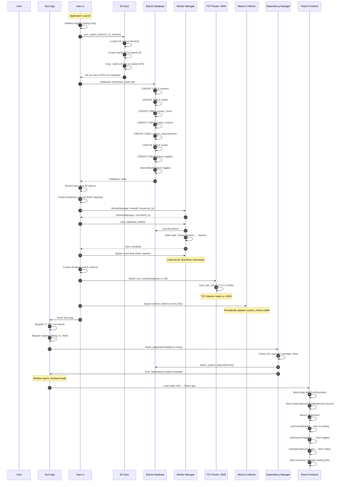
```mermaid
sequenceDiagram
    autonumber
    participant User
    participant Tauri as Tauri App
    participant Main as main.rs
    participant EASync as EA Sync
    participant DB as SQLite Database
    participant WM as Worker Manager
    participant Router as TCP Router :5000
    participant Metrics as Metrics Collector
    participant DepMgr as Dependency Manager
    participant UI as React Frontend

    Note over Main: Application Launch
    Main->>Main: Initialize logging (debug only)
    Main->>EASync: sync_expert_advisors_to_master()
    EASync->>EASync: Locate EA source directory
    EASync->>EASync: Locate master MT5 Experts dir
    EASync->>EASync: Copy .mq5/.ex5 files to master MT5
    EASync-->>Main: OK (or warn if MT5 not installed)

    Main->>DB: Database::new(trade_copier.db)
    DB->>DB: CREATE TABLE workers
    DB->>DB: CREATE TABLE trades
    DB->>DB: CREATE TABLE worker_errors
    DB->>DB: CREATE TABLE system_metrics
    DB->>DB: CREATE TABLE system_dependencies
    DB->>DB: CREATE TABLE profits
    DB->>DB: CREATE TABLE feature_toggles
    DB->>DB: Seed default feature toggles
    DB-->>Main: Database ready

    Main->>Main: Record start_time for uptime
    Main->>Main: Create broadcast channel (8192 capacity)
    Main->>WM: WorkerManager::new(db, broadcast_tx)
    WM-->>Main: (WorkerManager, command_rx)
    Main->>WM: sync_database_state()
    WM->>DB: Get all workers
    WM->>WM: Mark stale "active" workers → inactive
    WM-->>Main: Sync complete

    Main->>WM: Spawn event loop (tokio::spawn)
    Note over WM: Listening for Start/Stop commands

    Main->>Main: Create shutdown watch channel
    Main->>Router: Spawn run_router(broadcast_tx, db)
    Router->>Router: bind_with_retry(127.0.0.1:5000)
    Note over Router: TCP listener ready on :5000

    Main->>Metrics: Spawn metrics collector (every 30s)
    Note over Metrics: Periodically updates system_metrics table

    Main->>Tauri: Build Tauri app
    Tauri->>Tauri: Register 17 IPC commands
    Tauri->>Tauri: Register plugins (dialog, fs, shell)
    Tauri->>DepMgr: check_dependencies(db) on setup
    DepMgr->>DepMgr: Detect OS, package manager, Wine
    DepMgr->>DB: upsert_system_dependencies()
    DepMgr->>Tauri: Emit "dependency-status-changed"

    Note over Tauri: Window opens, frontend loads

    Tauri->>UI: Load index.html → React app
    UI->>UI: Mount App with ErrorBoundary
    UI->>UI: Show DependencyCheckModal (first launch)
    UI->>UI: Mount Dashboard
    UI->>UI: useTradingData() → start 2s polling
    UI->>UI: useFeatureToggles() → fetch toggles
    UI->>UI: useDependencyStatus() → fetch status
    UI->>UI: Start economic calendar polling (60s)
```

## Creating a New Worker Instance

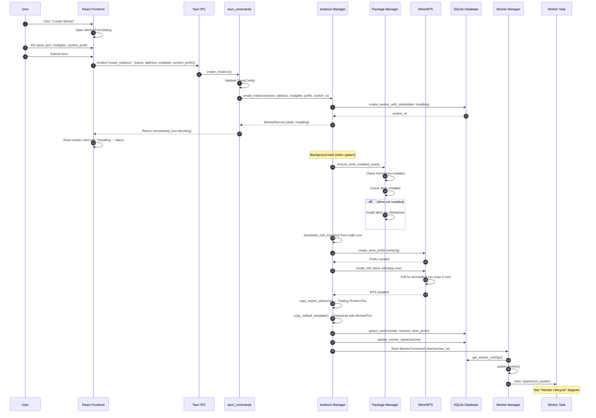
```mermaid
sequenceDiagram
    autonumber
    participant User
    participant UI as React Frontend
    participant Tauri as Tauri IPC
    participant Cmd as tauri_commands
    participant IM as Instance Manager
    participant PkgMgr as Package Manager
    participant Wine as Wine/MT5
    participant DB as SQLite Database
    participant WM as Worker Manager
    participant Worker as Worker Task

    User->>UI: Click "Create Worker"
    UI->>UI: Open WorkerFormDialog
    User->>UI: Fill name, port, multiplier, symbol_prefix
    User->>UI: Submit form

    UI->>Tauri: invoke("create_instance", {name, address, multiplier, symbol_prefix})
    Tauri->>Cmd: create_instance()
    Cmd->>Cmd: Validate SlaveConfig
    Cmd->>IM: create_instance(name, address, multiplier, prefix, worker_tx)

    IM->>DB: create_worker_with_state(state: Installing)
    DB-->>IM: worker_id
    IM-->>Cmd: WorkerRecord (state: installing)
    Cmd-->>UI: Return immediately (non-blocking)
    UI->>UI: Show worker card with "Installing..." status

    Note over IM: Background task (tokio::spawn)
    IM->>PkgMgr: ensure_wine_installed_auto()
    PkgMgr->>PkgMgr: Check Homebrew installed
    PkgMgr->>PkgMgr: Check Wine installed
    alt Wine not installed
        PkgMgr->>PkgMgr: Install Wine via Homebrew
    end

    IM->>IM: download_mt5_installer() from mql5.com
    IM->>Wine: create_wine_prefix (winecfg)
    Wine-->>IM: Prefix created
    IM->>Wine: install_mt5 (wine mt5setup.exe)
    Wine->>Wine: Poll for terminal64.exe (max 5 min)
    Wine-->>IM: MT5 installed

    IM->>IM: copy_expert_advisors() → Trading Rocket EAs
    IM->>IM: copy_default_template() → Default.tpl with WorkerPort

    IM->>DB: upsert_worker(state: Inactive, wine_prefix)
    IM->>DB: update_worker_state(Inactive)

    IM->>WM: Send WorkerCommand::Start(worker_id)
    WM->>DB: get_worker_configs()
    WM->>WM: spawn_worker()
    WM->>Worker: tokio::spawn(run_worker)

    Note over Worker: See "Worker Lifecycle" diagram
```

## Worker Lifecycle (Start → Active → Shutdown)

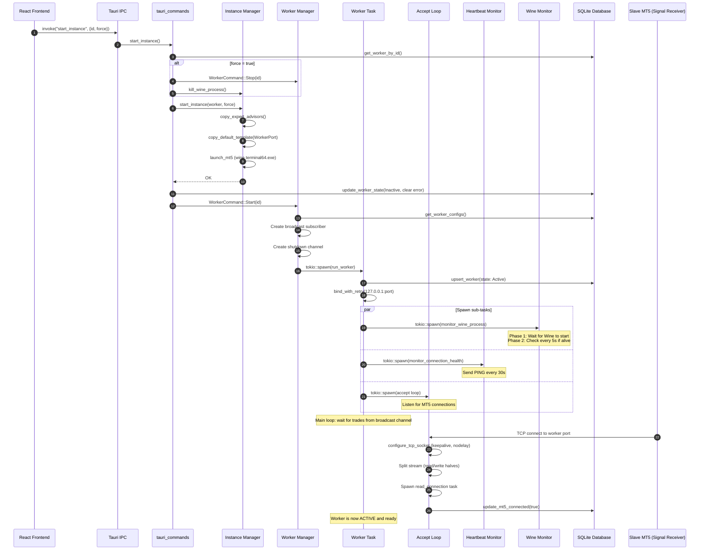
```mermaid
sequenceDiagram
    autonumber
    participant UI as React Frontend
    participant Tauri as Tauri IPC
    participant Cmd as tauri_commands
    participant IM as Instance Manager
    participant WM as Worker Manager
    participant Worker as Worker Task
    participant Accept as Accept Loop
    participant HB as Heartbeat Monitor
    participant WineMon as Wine Monitor
    participant DB as SQLite Database
    participant MT5Slave as Slave MT5 (Signal Receiver)

    UI->>Tauri: invoke("start_instance", {id, force})
    Tauri->>Cmd: start_instance()
    Cmd->>DB: get_worker_by_id()
    alt force = true
        Cmd->>WM: WorkerCommand::Stop(id)
        Cmd->>IM: kill_wine_process()
    end

    Cmd->>IM: start_instance(worker, force)
    IM->>IM: copy_expert_advisors()
    IM->>IM: copy_default_template(WorkerPort)
    IM->>IM: launch_mt5 (wine terminal64.exe)
    IM-->>Cmd: OK

    Cmd->>DB: update_worker_state(Inactive, clear error)
    Cmd->>WM: WorkerCommand::Start(id)

    WM->>DB: get_worker_configs()
    WM->>WM: Create broadcast subscriber
    WM->>WM: Create shutdown channel
    WM->>Worker: tokio::spawn(run_worker)

    Worker->>DB: upsert_worker(state: Active)
    Worker->>Worker: bind_with_retry(127.0.0.1:port)

    par Spawn sub-tasks
        Worker->>WineMon: tokio::spawn(monitor_wine_process)
        Note over WineMon: Phase 1: Wait for Wine to start<br/>Phase 2: Check every 5s if alive
    and
        Worker->>HB: tokio::spawn(monitor_connection_health)
        Note over HB: Send PING every 30s
    and
        Worker->>Accept: tokio::spawn(accept loop)
        Note over Accept: Listen for MT5 connections
    end

    Note over Worker: Main loop: wait for trades from broadcast channel

    MT5Slave->>Accept: TCP connect to worker port
    Accept->>Accept: configure_tcp_socket (keepalive, nodelay)
    Accept->>Accept: Split stream (read/write halves)
    Accept->>Accept: Spawn read_connection task
    Accept->>DB: update_mt5_connected(true)

    Note over Worker: Worker is now ACTIVE and ready
```

## Trade Signal Flow (Open / Close / Modify)

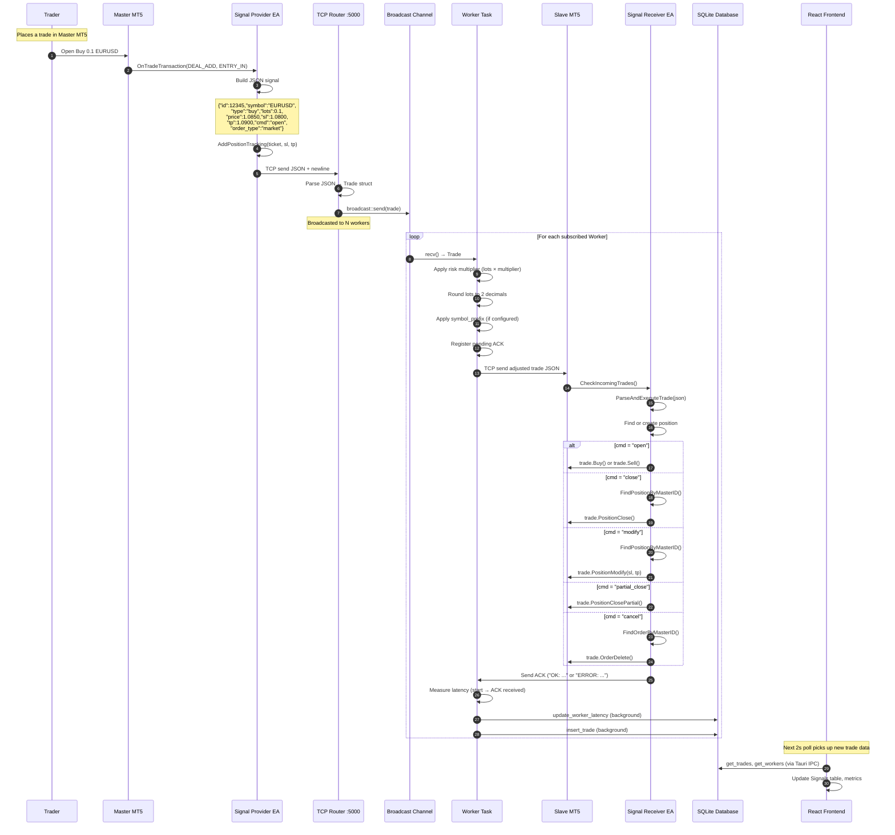
```mermaid
sequenceDiagram
    autonumber
    participant Trader as Trader
    participant MasterMT5 as Master MT5
    participant Provider as Signal Provider EA
    participant Router as TCP Router :5000
    participant Broadcast as Broadcast Channel
    participant Worker as Worker Task
    participant SlaveMT5 as Slave MT5
    participant Receiver as Signal Receiver EA
    participant DB as SQLite Database
    participant UI as React Frontend

    Note over Trader: Places a trade in Master MT5

    Trader->>MasterMT5: Open Buy 0.1 EURUSD
    MasterMT5->>Provider: OnTradeTransaction(DEAL_ADD, ENTRY_IN)
    Provider->>Provider: Build JSON signal
    Note over Provider: {"id":12345,"symbol":"EURUSD",<br/>"type":"buy","lots":0.1,<br/>"price":1.0850,"sl":1.0800,<br/>"tp":1.0900,"cmd":"open",<br/>"order_type":"market"}
    Provider->>Provider: AddPositionTracking(ticket, sl, tp)
    Provider->>Router: TCP send JSON + newline

    Router->>Router: Parse JSON → Trade struct
    Router->>Broadcast: broadcast::send(trade)
    Note over Router: Broadcasted to N workers

    loop For each subscribed Worker
        Broadcast->>Worker: recv() → Trade
        Worker->>Worker: Apply risk multiplier (lots × multiplier)
        Worker->>Worker: Round lots to 2 decimals
        Worker->>Worker: Apply symbol_prefix (if configured)
        Worker->>Worker: Register pending ACK
        Worker->>SlaveMT5: TCP send adjusted trade JSON

        SlaveMT5->>Receiver: CheckIncomingTrades()
        Receiver->>Receiver: ParseAndExecuteTrade(json)
        Receiver->>Receiver: Find or create position
        alt cmd = "open"
            Receiver->>SlaveMT5: trade.Buy() or trade.Sell()
        else cmd = "close"
            Receiver->>Receiver: FindPositionByMasterID()
            Receiver->>SlaveMT5: trade.PositionClose()
        else cmd = "modify"
            Receiver->>Receiver: FindPositionByMasterID()
            Receiver->>SlaveMT5: trade.PositionModify(sl, tp)
        else cmd = "partial_close"
            Receiver->>SlaveMT5: trade.PositionClosePartial()
        else cmd = "cancel"
            Receiver->>Receiver: FindOrderByMasterID()
            Receiver->>SlaveMT5: trade.OrderDelete()
        end

        Receiver->>Worker: Send ACK ("OK: ..." or "ERROR: ...")

        Worker->>Worker: Measure latency (start → ACK received)
        Worker->>DB: update_worker_latency (background)
        Worker->>DB: insert_trade (background)
    end

    Note over UI: Next 2s poll picks up new trade data
    UI->>DB: get_trades, get_workers (via Tauri IPC)
    UI->>UI: Update Signals table, metrics
```

## Profit Reporting Flow

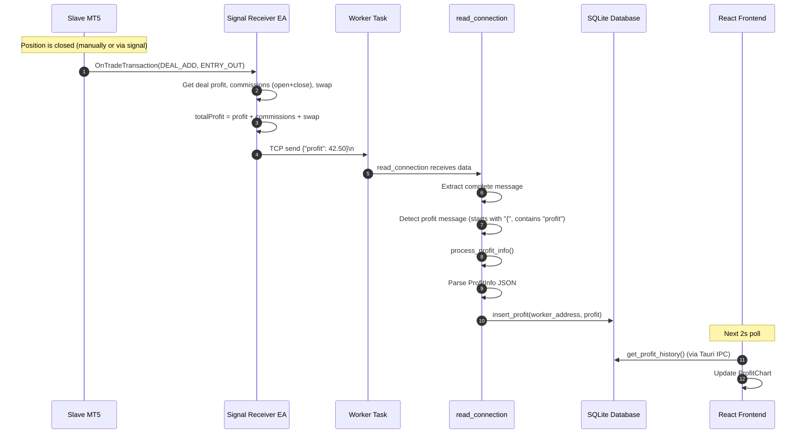
```mermaid
sequenceDiagram
    autonumber
    participant SlaveMT5 as Slave MT5
    participant Receiver as Signal Receiver EA
    participant Worker as Worker Task
    participant Reader as read_connection
    participant DB as SQLite Database
    participant UI as React Frontend

    Note over SlaveMT5: Position is closed (manually or via signal)

    SlaveMT5->>Receiver: OnTradeTransaction(DEAL_ADD, ENTRY_OUT)
    Receiver->>Receiver: Get deal profit, commissions (open+close), swap
    Receiver->>Receiver: totalProfit = profit + commissions + swap

    Receiver->>Worker: TCP send {"profit": 42.50}\n

    Worker->>Reader: read_connection receives data
    Reader->>Reader: Extract complete message
    Reader->>Reader: Detect profit message (starts with "{", contains "profit")
    Reader->>Reader: process_profit_info()
    Reader->>Reader: Parse ProfitInfo JSON
    Reader->>DB: insert_profit(worker_address, profit)

    Note over UI: Next 2s poll
    UI->>DB: get_profit_history() (via Tauri IPC)
    UI->>UI: Update ProfitChart
```

## Modify Detection (SL/TP Changes)

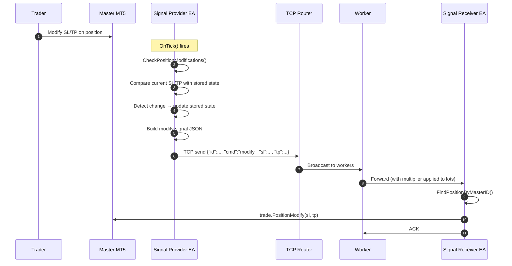
```mermaid
sequenceDiagram
    autonumber
    participant Trader as Trader
    participant MasterMT5 as Master MT5
    participant Provider as Signal Provider EA
    participant Router as TCP Router
    participant Worker as Worker
    participant Receiver as Signal Receiver EA

    Trader->>MasterMT5: Modify SL/TP on position

    Note over Provider: OnTick() fires
    Provider->>Provider: CheckPositionModifications()
    Provider->>Provider: Compare current SL/TP with stored state
    Provider->>Provider: Detect change → update stored state
    Provider->>Provider: Build modify signal JSON
    Provider->>Router: TCP send {"id":..., "cmd":"modify", "sl":..., "tp":...}

    Router->>Worker: Broadcast to workers
    Worker->>Receiver: Forward (with multiplier applied to lots)
    Receiver->>Receiver: FindPositionByMasterID()
    Receiver->>MasterMT5: trade.PositionModify(sl, tp)
    Receiver->>Worker: ACK
```

## Pending Orders Flow

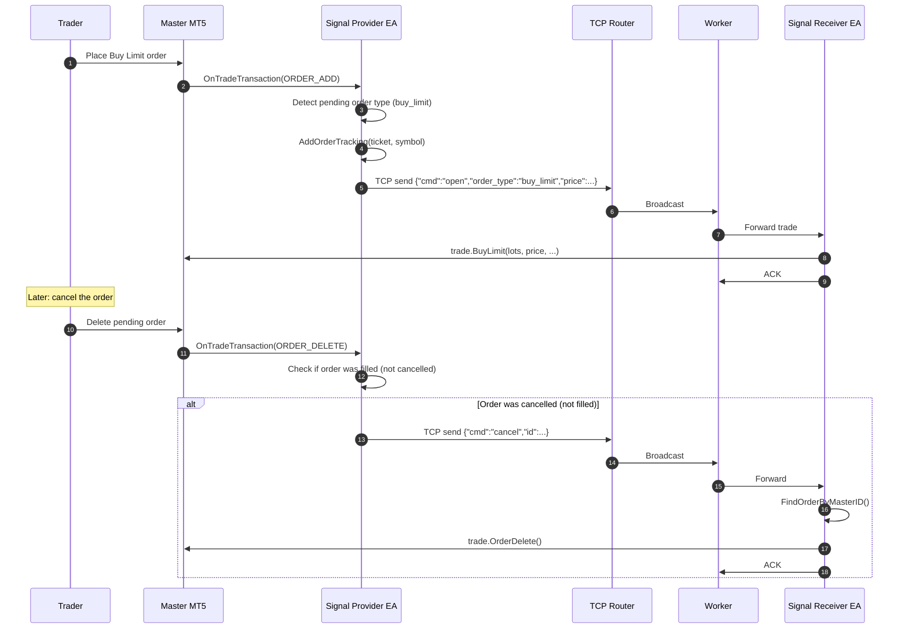
```mermaid
sequenceDiagram
    autonumber
    participant Trader as Trader
    participant MasterMT5 as Master MT5
    participant Provider as Signal Provider EA
    participant Router as TCP Router
    participant Worker as Worker
    participant Receiver as Signal Receiver EA

    Trader->>MasterMT5: Place Buy Limit order
    MasterMT5->>Provider: OnTradeTransaction(ORDER_ADD)
    Provider->>Provider: Detect pending order type (buy_limit)
    Provider->>Provider: AddOrderTracking(ticket, symbol)
    Provider->>Router: TCP send {"cmd":"open","order_type":"buy_limit","price":...}
    Router->>Worker: Broadcast
    Worker->>Receiver: Forward trade
    Receiver->>MasterMT5: trade.BuyLimit(lots, price, ...)
    Receiver->>Worker: ACK

    Note over Trader: Later: cancel the order
    Trader->>MasterMT5: Delete pending order
    MasterMT5->>Provider: OnTradeTransaction(ORDER_DELETE)
    Provider->>Provider: Check if order was filled (not cancelled)
    alt Order was cancelled (not filled)
        Provider->>Router: TCP send {"cmd":"cancel","id":...}
        Router->>Worker: Broadcast
        Worker->>Receiver: Forward
        Receiver->>Receiver: FindOrderByMasterID()
        Receiver->>MasterMT5: trade.OrderDelete()
        Receiver->>Worker: ACK
    end
```

## Signal Provider Connection Management

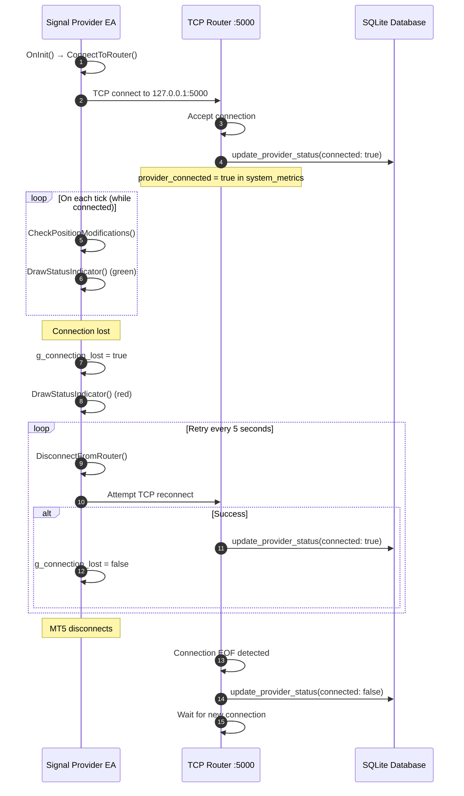
```mermaid
sequenceDiagram
    autonumber
    participant Provider as Signal Provider EA
    participant Router as TCP Router :5000
    participant DB as SQLite Database

    Provider->>Provider: OnInit() → ConnectToRouter()
    Provider->>Router: TCP connect to 127.0.0.1:5000
    Router->>Router: Accept connection
    Router->>DB: update_provider_status(connected: true)
    Note over Router: provider_connected = true in system_metrics

    loop On each tick (while connected)
        Provider->>Provider: CheckPositionModifications()
        Provider->>Provider: DrawStatusIndicator() (green)
    end

    Note over Provider: Connection lost
    Provider->>Provider: g_connection_lost = true
    Provider->>Provider: DrawStatusIndicator() (red)

    loop Retry every 5 seconds
        Provider->>Provider: DisconnectFromRouter()
        Provider->>Router: Attempt TCP reconnect
        alt Success
            Router->>DB: update_provider_status(connected: true)
            Provider->>Provider: g_connection_lost = false
        end
    end

    Note over Provider: MT5 disconnects
    Router->>Router: Connection EOF detected
    Router->>DB: update_provider_status(connected: false)
    Router->>Router: Wait for new connection
```

## Heartbeat & Connection Health Monitoring

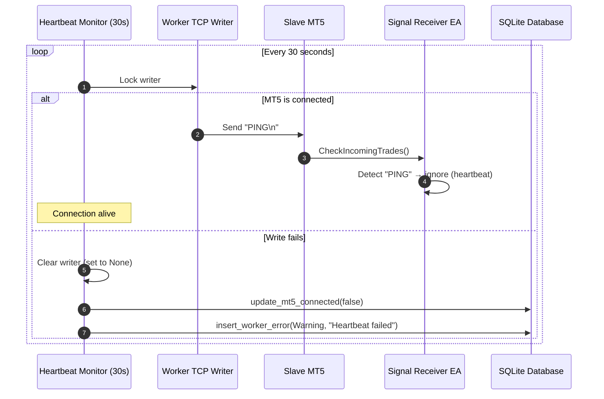
```mermaid
sequenceDiagram
    autonumber
    participant HB as Heartbeat Monitor (30s)
    participant Worker as Worker TCP Writer
    participant SlaveMT5 as Slave MT5
    participant Receiver as Signal Receiver EA
    participant DB as SQLite Database

    loop Every 30 seconds
        HB->>Worker: Lock writer
        alt MT5 is connected
            Worker->>SlaveMT5: Send "PING\n"
            SlaveMT5->>Receiver: CheckIncomingTrades()
            Receiver->>Receiver: Detect "PING" → ignore (heartbeat)
            Note over HB: Connection alive
        else Write fails
            HB->>HB: Clear writer (set to None)
            HB->>DB: update_mt5_connected(false)
            HB->>DB: insert_worker_error(Warning, "Heartbeat failed")
        end
    end
```

## Wine Process Monitoring

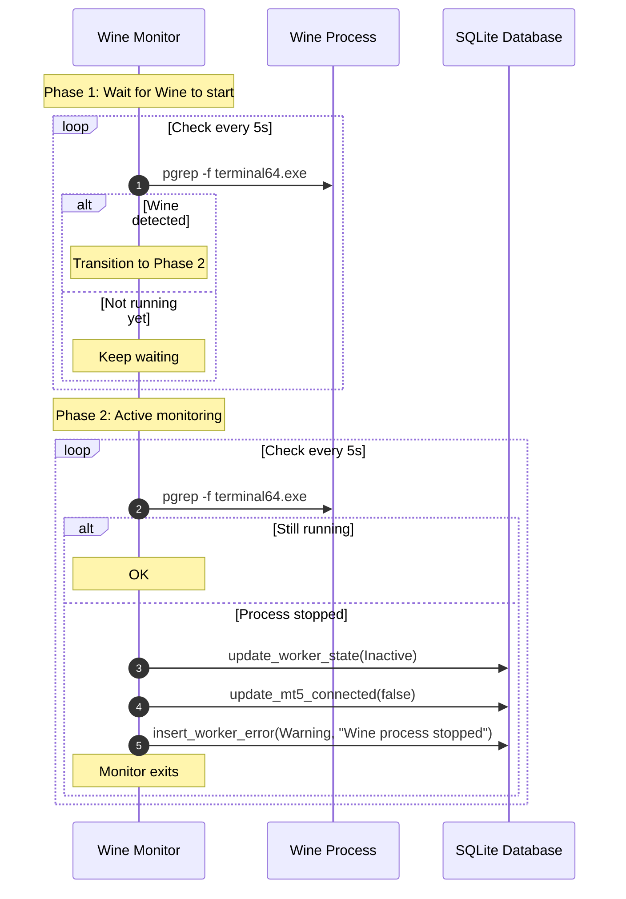
```mermaid
sequenceDiagram
    autonumber
    participant WineMon as Wine Monitor
    participant Wine as Wine Process
    participant DB as SQLite Database

    Note over WineMon: Phase 1: Wait for Wine to start
    loop Check every 5s
        WineMon->>Wine: pgrep -f terminal64.exe
        alt Wine detected
            Note over WineMon: Transition to Phase 2
        else Not running yet
            Note over WineMon: Keep waiting
        end
    end

    Note over WineMon: Phase 2: Active monitoring
    loop Check every 5s
        WineMon->>Wine: pgrep -f terminal64.exe
        alt Still running
            Note over WineMon: OK
        else Process stopped
            WineMon->>DB: update_worker_state(Inactive)
            WineMon->>DB: update_mt5_connected(false)
            WineMon->>DB: insert_worker_error(Warning, "Wine process stopped")
            Note over WineMon: Monitor exits
        end
    end
```

## System Metrics Collection

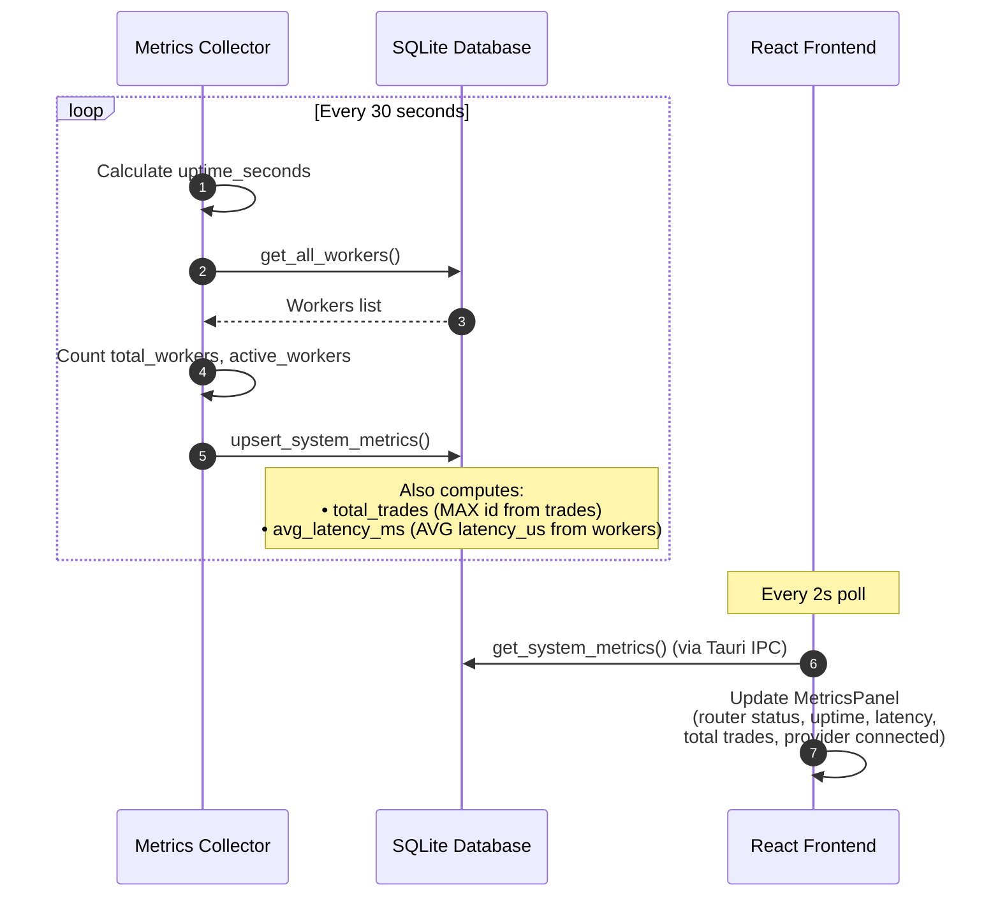
```mermaid
sequenceDiagram
    autonumber
    participant Metrics as Metrics Collector
    participant DB as SQLite Database
    participant UI as React Frontend

    loop Every 30 seconds
        Metrics->>Metrics: Calculate uptime_seconds
        Metrics->>DB: get_all_workers()
        DB-->>Metrics: Workers list
        Metrics->>Metrics: Count total_workers, active_workers
        Metrics->>DB: upsert_system_metrics()
        Note over DB: Also computes:<br/>• total_trades (MAX id from trades)<br/>• avg_latency_ms (AVG latency_us from workers)
    end

    Note over UI: Every 2s poll
    UI->>DB: get_system_metrics() (via Tauri IPC)
    UI->>UI: Update MetricsPanel<br/>(router status, uptime, latency,<br/>total trades, provider connected)
```

## Economic Calendar Flow

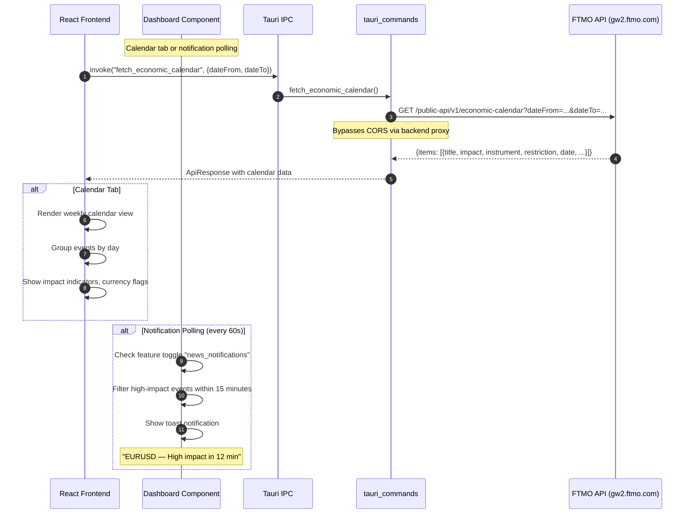
```mermaid
sequenceDiagram
    autonumber
    participant UI as React Frontend
    participant Dashboard as Dashboard Component
    participant Tauri as Tauri IPC
    participant Cmd as tauri_commands
    participant FTMO as FTMO API (gw2.ftmo.com)

    Note over Dashboard: Calendar tab or notification polling

    UI->>Tauri: invoke("fetch_economic_calendar", {dateFrom, dateTo})
    Tauri->>Cmd: fetch_economic_calendar()
    Cmd->>FTMO: GET /public-api/v1/economic-calendar?dateFrom=...&dateTo=...
    Note over Cmd: Bypasses CORS via backend proxy
    FTMO-->>Cmd: {items: [{title, impact, instrument, restriction, date, ...}]}
    Cmd-->>UI: ApiResponse with calendar data

    alt Calendar Tab
        UI->>UI: Render weekly calendar view
        UI->>UI: Group events by day
        UI->>UI: Show impact indicators, currency flags
    end

    alt Notification Polling (every 60s)
        Dashboard->>Dashboard: Check feature toggle "news_notifications"
        Dashboard->>Dashboard: Filter high-impact events within 15 minutes
        Dashboard->>Dashboard: Show toast notification
        Note over Dashboard: "EURUSD — High impact in 12 min"
    end
```

## Dependency Check & Installation

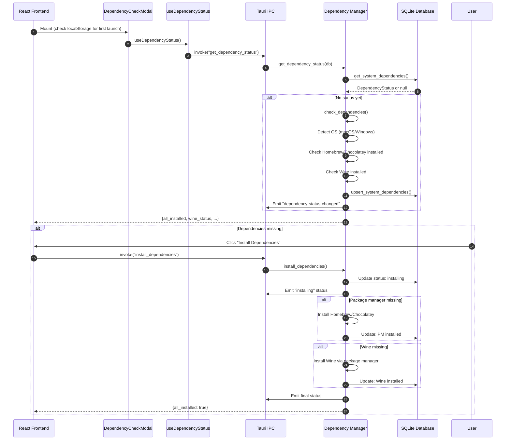
```mermaid
sequenceDiagram
    autonumber
    participant UI as React Frontend
    participant Modal as DependencyCheckModal
    participant Hook as useDependencyStatus
    participant Tauri as Tauri IPC
    participant DepMgr as Dependency Manager
    participant DB as SQLite Database

    UI->>Modal: Mount (check localStorage for first launch)
    Modal->>Hook: useDependencyStatus()
    Hook->>Tauri: invoke("get_dependency_status")
    Tauri->>DepMgr: get_dependency_status(db)
    DepMgr->>DB: get_system_dependencies()
    DB-->>DepMgr: DependencyStatus or null
    alt No status yet
        DepMgr->>DepMgr: check_dependencies()
        DepMgr->>DepMgr: Detect OS (macOS/Windows)
        DepMgr->>DepMgr: Check Homebrew/Chocolatey installed
        DepMgr->>DepMgr: Check Wine installed
        DepMgr->>DB: upsert_system_dependencies()
        DepMgr->>Tauri: Emit "dependency-status-changed"
    end
    DepMgr-->>UI: {all_installed, wine_status, ...}

    alt Dependencies missing
        User->>UI: Click "Install Dependencies"
        UI->>Tauri: invoke("install_dependencies")
        Tauri->>DepMgr: install_dependencies()
        DepMgr->>DB: Update status: installing
        DepMgr->>Tauri: Emit "installing" status

        alt Package manager missing
            DepMgr->>DepMgr: Install Homebrew/Chocolatey
            DepMgr->>DB: Update: PM installed
        end
        alt Wine missing
            DepMgr->>DepMgr: Install Wine via package manager
            DepMgr->>DB: Update: Wine installed
        end

        DepMgr->>Tauri: Emit final status
        DepMgr-->>UI: {all_installed: true}
    end
```

## Frontend Polling & Data Flow

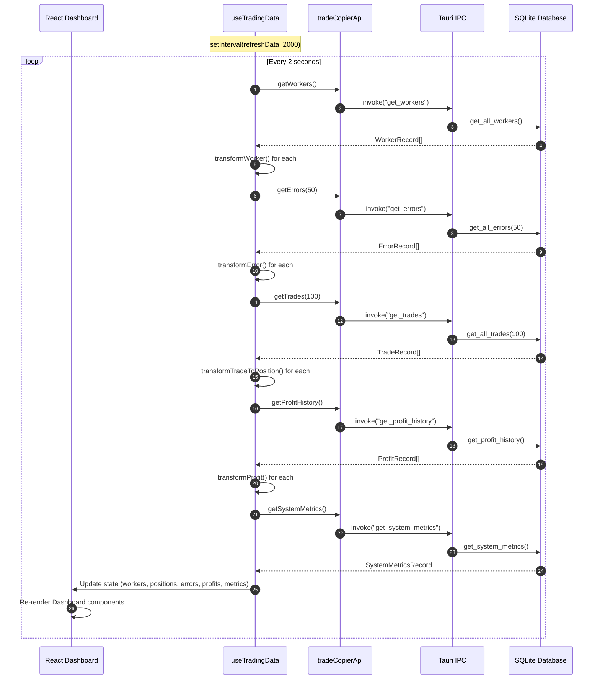
```mermaid
sequenceDiagram
    autonumber
    participant UI as React Dashboard
    participant Hook as useTradingData
    participant API as tradeCopierApi
    participant Tauri as Tauri IPC
    participant DB as SQLite Database

    Note over Hook: setInterval(refreshData, 2000)

    loop Every 2 seconds
        Hook->>API: getWorkers()
        API->>Tauri: invoke("get_workers")
        Tauri->>DB: get_all_workers()
        DB-->>Hook: WorkerRecord[]
        Hook->>Hook: transformWorker() for each

        Hook->>API: getErrors(50)
        API->>Tauri: invoke("get_errors")
        Tauri->>DB: get_all_errors(50)
        DB-->>Hook: ErrorRecord[]
        Hook->>Hook: transformError() for each

        Hook->>API: getTrades(100)
        API->>Tauri: invoke("get_trades")
        Tauri->>DB: get_all_trades(100)
        DB-->>Hook: TradeRecord[]
        Hook->>Hook: transformTradeToPosition() for each

        Hook->>API: getProfitHistory()
        API->>Tauri: invoke("get_profit_history")
        Tauri->>DB: get_profit_history()
        DB-->>Hook: ProfitRecord[]
        Hook->>Hook: transformProfit() for each

        Hook->>API: getSystemMetrics()
        API->>Tauri: invoke("get_system_metrics")
        Tauri->>DB: get_system_metrics()
        DB-->>Hook: SystemMetricsRecord

        Hook->>UI: Update state (workers, positions, errors, profits, metrics)
        UI->>UI: Re-render Dashboard components
    end
```

## Updating a Worker

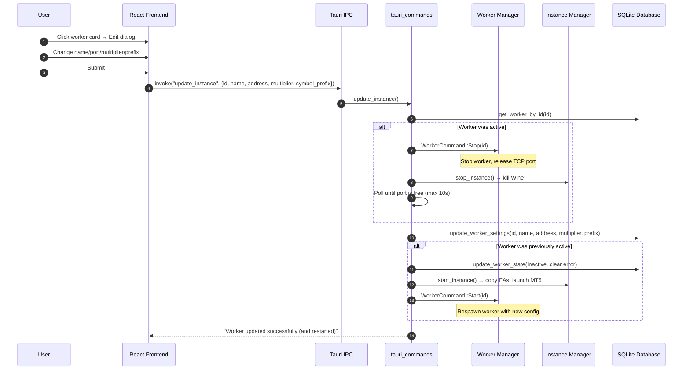
```mermaid
sequenceDiagram
    autonumber
    participant User
    participant UI as React Frontend
    participant Tauri as Tauri IPC
    participant Cmd as tauri_commands
    participant WM as Worker Manager
    participant IM as Instance Manager
    participant DB as SQLite Database

    User->>UI: Click worker card → Edit dialog
    User->>UI: Change name/port/multiplier/prefix
    User->>UI: Submit

    UI->>Tauri: invoke("update_instance", {id, name, address, multiplier, symbol_prefix})
    Tauri->>Cmd: update_instance()
    Cmd->>DB: get_worker_by_id(id)

    alt Worker was active
        Cmd->>WM: WorkerCommand::Stop(id)
        Note over WM: Stop worker, release TCP port
        Cmd->>IM: stop_instance() → kill Wine
        Cmd->>Cmd: Poll until port is free (max 10s)
    end

    Cmd->>DB: update_worker_settings(id, name, address, multiplier, prefix)

    alt Worker was previously active
        Cmd->>DB: update_worker_state(Inactive, clear error)
        Cmd->>IM: start_instance() → copy EAs, launch MT5
        Cmd->>WM: WorkerCommand::Start(id)
        Note over WM: Respawn worker with new config
    end

    Cmd-->>UI: "Worker updated successfully (and restarted)"
```

## Deleting a Worker

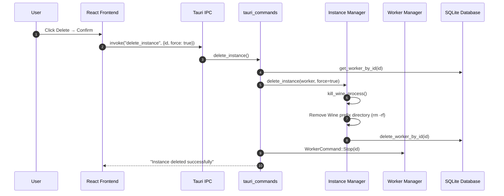
```mermaid
sequenceDiagram
    autonumber
    participant User
    participant UI as React Frontend
    participant Tauri as Tauri IPC
    participant Cmd as tauri_commands
    participant IM as Instance Manager
    participant WM as Worker Manager
    participant DB as SQLite Database

    User->>UI: Click Delete → Confirm
    UI->>Tauri: invoke("delete_instance", {id, force: true})
    Tauri->>Cmd: delete_instance()
    Cmd->>DB: get_worker_by_id(id)
    Cmd->>IM: delete_instance(worker, force=true)
    IM->>IM: kill_wine_process()
    IM->>IM: Remove Wine prefix directory (rm -rf)
    IM->>DB: delete_worker_by_id(id)
    Cmd->>WM: WorkerCommand::Stop(id)
    Cmd-->>UI: "Instance deleted successfully"
```

## Feature Toggles

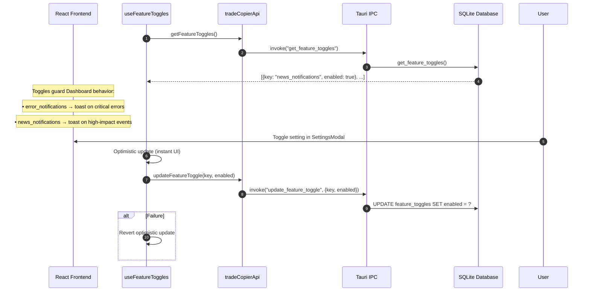
```mermaid
sequenceDiagram
    autonumber
    participant UI as React Frontend
    participant Hook as useFeatureToggles
    participant API as tradeCopierApi
    participant Tauri as Tauri IPC
    participant DB as SQLite Database

    Hook->>API: getFeatureToggles()
    API->>Tauri: invoke("get_feature_toggles")
    Tauri->>DB: get_feature_toggles()
    DB-->>Hook: [{key: "news_notifications", enabled: true}, ...]

    Note over UI: Toggles guard Dashboard behavior:
    Note over UI: • error_notifications → toast on critical errors
    Note over UI: • news_notifications → toast on high-impact events

    User->>UI: Toggle setting in SettingsModal
    Hook->>Hook: Optimistic update (instant UI)
    Hook->>API: updateFeatureToggle(key, enabled)
    API->>Tauri: invoke("update_feature_toggle", {key, enabled})
    Tauri->>DB: UPDATE feature_toggles SET enabled = ?
    alt Failure
        Hook->>Hook: Revert optimistic update
    end
```

## Graceful Application Shutdown

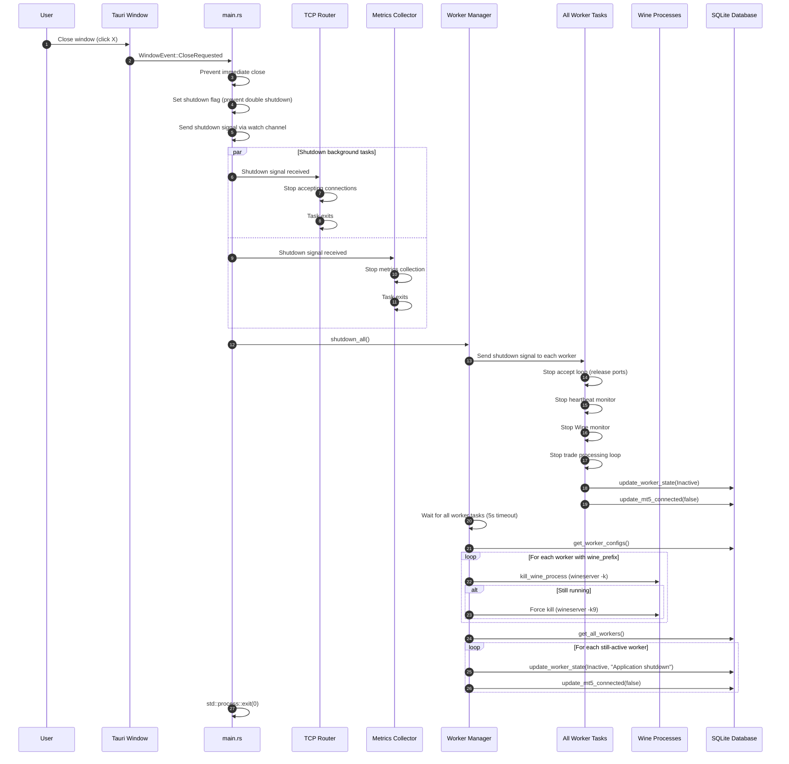
```mermaid
sequenceDiagram
    autonumber
    participant User
    participant Tauri as Tauri Window
    participant Main as main.rs
    participant Router as TCP Router
    participant Metrics as Metrics Collector
    participant WM as Worker Manager
    participant Workers as All Worker Tasks
    participant Wine as Wine Processes
    participant DB as SQLite Database

    User->>Tauri: Close window (click X)
    Tauri->>Main: WindowEvent::CloseRequested
    Main->>Main: Prevent immediate close
    Main->>Main: Set shutdown flag (prevent double shutdown)
    Main->>Main: Send shutdown signal via watch channel

    par Shutdown background tasks
        Main->>Router: Shutdown signal received
        Router->>Router: Stop accepting connections
        Router->>Router: Task exits
    and
        Main->>Metrics: Shutdown signal received
        Metrics->>Metrics: Stop metrics collection
        Metrics->>Metrics: Task exits
    end

    Main->>WM: shutdown_all()
    WM->>Workers: Send shutdown signal to each worker
    Workers->>Workers: Stop accept loop (release ports)
    Workers->>Workers: Stop heartbeat monitor
    Workers->>Workers: Stop Wine monitor
    Workers->>Workers: Stop trade processing loop
    Workers->>DB: update_worker_state(Inactive)
    Workers->>DB: update_mt5_connected(false)
    WM->>WM: Wait for all worker tasks (5s timeout)

    WM->>DB: get_worker_configs()
    loop For each worker with wine_prefix
        WM->>Wine: kill_wine_process (wineserver -k)
        alt Still running
            WM->>Wine: Force kill (wineserver -k9)
        end
    end

    WM->>DB: get_all_workers()
    loop For each still-active worker
        WM->>DB: update_worker_state(Inactive, "Application shutdown")
        WM->>DB: update_mt5_connected(false)
    end

    Main->>Main: std::process::exit(0)
```

## Error Notification Flow

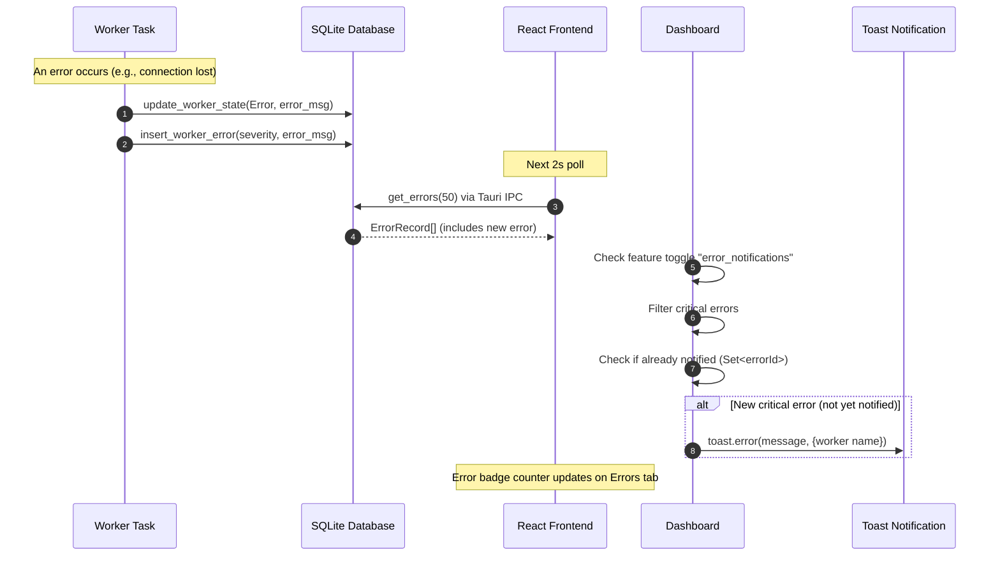
```mermaid
sequenceDiagram
    autonumber
    participant Worker as Worker Task
    participant DB as SQLite Database
    participant UI as React Frontend
    participant Dashboard as Dashboard
    participant Toast as Toast Notification

    Note over Worker: An error occurs (e.g., connection lost)
    Worker->>DB: update_worker_state(Error, error_msg)
    Worker->>DB: insert_worker_error(severity, error_msg)

    Note over UI: Next 2s poll
    UI->>DB: get_errors(50) via Tauri IPC
    DB-->>UI: ErrorRecord[] (includes new error)

    Dashboard->>Dashboard: Check feature toggle "error_notifications"
    Dashboard->>Dashboard: Filter critical errors
    Dashboard->>Dashboard: Check if already notified (Set<errorId>)
    alt New critical error (not yet notified)
        Dashboard->>Toast: toast.error(message, {worker name})
    end

    Note over UI: Error badge counter updates on Errors tab
```
